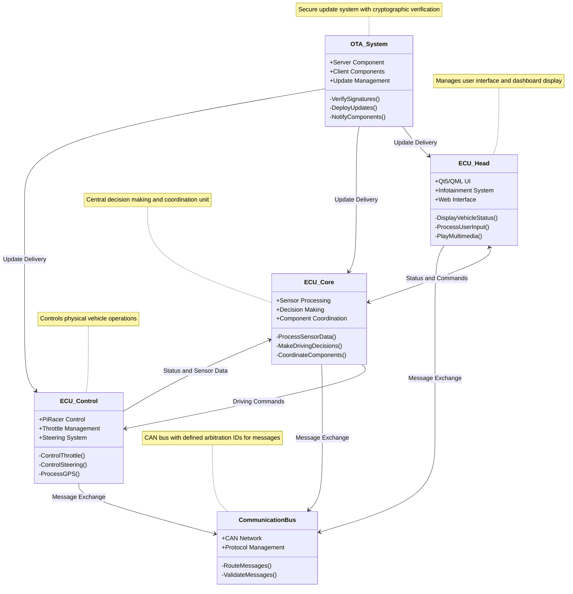
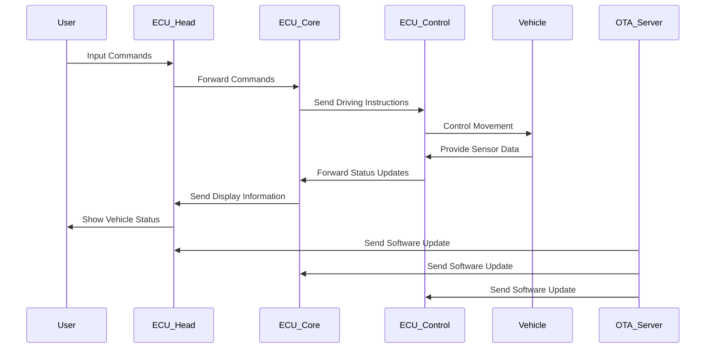

# Software-Defined-Vehicle
This repository is for the OS Unit part of the Autonomous-Driving-System project.

## Key Components

### ECU-HeadUnit
The Head Unit component displays the vehicle's status and provides user interface for in-vehicle infotainment:

- **Technology Stack**: Qt5/QML, C++
- **Features**:
  - Real-time vehicle status display
  - Infotainment controls (audio, climate)
  - CAN bus communication with ECU-Core
  - Web browser integration via QtWebEngine
  - Multi-media playback

### ECU-Control
The Control component manages the physical vehicle operations:

- **Hardware**: Raspberry Pi with 2-CH CAN FD HAT
- **Features**:
  - Controls PiRacer model vehicle throttle and steering
  - Receives commands via CAN communication
  - Real-time response to driving inputs
  - Supports both autonomous and manual control modes
- **CAN Communication Protocol**:
  | Message | Purpose | Arbitration ID |
  |---------|---------|---------------|
  | steering | Control | 0x00 |
  | throttle | Control | 0x01 |
  | x position | GPS | 0x02 |
  | y position | GPS | 0x03 |
  | orientation | GPS | 0x04 |
  | headunit start | Autonomous driving | 0x05 |

### ECU-Core (will be added in the future)
The Core component serves as the central processing and decision-making unit:

- **Hardware**: Raspberry Pi with 2-CH CAN FD HAT, YDLIDAR X4, RealSense D435 depth camera
- **Features**:
  - Publishes LIDAR scan data as ROS2 topics
  - Publishes depth camera image data as ROS2 topics
  - Converts ROS2 topics to CAN messages for vehicle control
  - Controls autonomous driving mode execution
  - Coordinates between sensor inputs and vehicle controls
- **Dependencies**:
  - ROS2 Foxy
  - YDLidar-SDK
  - RealSense SDK
  - OpenCV and Python packages (numpy, transforms3d)

### Secure OTA System
The Over-The-Air update system ensures secure software updates:

- **Security Features**:
  - End-to-End Encryption (TLS 1.3)
  - Mutual Authentication (PKI with RSA-4096/ECC)
  - Firmware Integrity (SHA-256 + ECDSA signatures)
  - Rollback Protection
  - Secure Boot via TPM/HSM
- **Components**:
  - Update server (Flask/Python)
  - MQTT broker for notification
  - Client update application
  - Signature verification system

### Yocto Integration
The system runs on a customized Linux distribution built with Yocto:

- **Target Hardware**: Raspberry Pi 4
- **Configurations**:
  - Wayland display server support
  - CAN bus drivers (mcp251xfd)
  - Camera support
  - SystemD initialization
  - I2C device support

## Getting Started

### Prerequisites
- Docker and Docker Compose
- CMake build system
- Qt 5 development libraries
- Yocto Project toolchain
- Ubuntu 20.04 (for ECU-Control)
- 2-CH CAN FD HAT (for CAN communication)
- Python packages: piracer-py, python-can, pygame

### Development Setup
1. Clone the repository:
   ```bash
   git clone https://github.com/yourusername/SW_Define_Vehicle.git
   cd SW_Define_Vehicle
   ```

2. Build the Head Unit for development:
   ```bash
   cd ECU-HEAD
   mkdir build && cd build
   cmake ..
   make
   ```

3. Set up the ECU-Control environment:
   ```bash
   cd ECU-Control
   pip install piracer-py python-can pygame
   sh can_setup.sh
   python3 src/control.py
   ```

4. Set up the Yocto build environment:
   ```bash
   cd meta-sdv
   ./conf.sh
   ```

5. Configure the OTA server:
   ```bash
   cd Secure-OTA-Application
   openssl req -x509 -newkey rsa:4096 -nodes -keyout server.key -out server.pem -days 365
   docker-compose up --build
   ```

## System Architecture

### UML Architecture Diagram


### Data Flow Visualization


## Deployment Architecture

The SDV architecture follows these principles:

1. **Service Isolation**: Each vehicle function runs as an isolated service
2. **Secure Communication**: All inter-service communication is authenticated and encrypted
3. **Modular Updates**: Components can be updated independently through the OTA system
4. **Hardware Abstraction**: Services communicate through standardized APIs regardless of underlying hardware

### Future Kubernetes Integration

While the current implementation uses direct deployment, the architecture is designed to be container-ready for Kubernetes orchestration:

- Services are modular and can be containerized
- Communication uses network protocols rather than direct IPC
- Configuration is externalized for environment-specific settings
- Resources are managed through standardized interfaces

## Security Considerations

- All OTA updates are cryptographically signed
- Communication between components uses TLS encryption
- Certificate-based authentication for all system components
- Secure boot ensures only trusted code execution
- Hardware security modules protect critical keys

## Contributing

Please follow the contribution guidelines in CONTRIBUTING.md. All pull requests must pass automated tests and code review before merging.

## License

This project is licensed under the MIT License - see the LICENSE file for details.

## Acknowledgments

- Qt Project
- Yocto Project
- OpenSSL
- Raspberry Pi Foundation
- PiRacer
